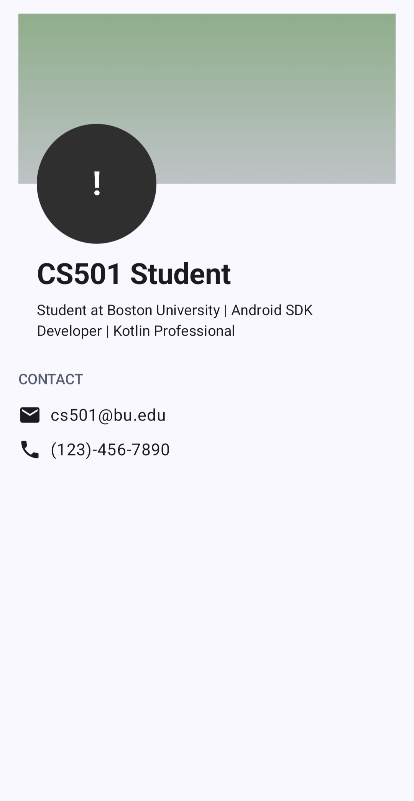

# Profile Screen App

This project is a profile page built using **Kotlin** and **Jetpack Compose**.  
The app demonstrates layout layering, positioning, and Material 3 UI components. The layout includes a gradient header background, a circular avatar, and profile information such as name, bio, and contact details.

## Features
- Full-screen gradient background
- Circular avatar placeholder
- Profile name and bio text
- Email and phone contact information
- Use of Box layering and positioning
- Material 3 components and styling

---

## Screenshot

---

## AI Disclosure
I used AI to generate a visual mockup image to help plan the layout of the profile screen. I also used AI to better understand one of the layout examples discussed in class. I asked AI how to create a gradient background and about positioning and dimensions in Kotlin and Jetpack Compose. AI was helpful for explaining the concepts and improving my understanding, but it was not very helpful in executing any layout changes.

---
